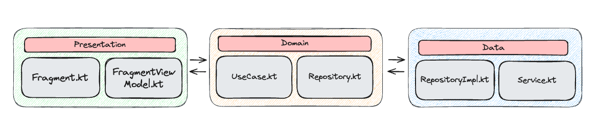

# Pokemon-api-application

This project is a native Android app developed to simulate a Pokedex, consuming
the [PokeApi](https://pokeapi.co/). It's an application developed following the best practices in
Android Development.

## 📌 Table of Contents
- [📱 UI & Features](#-ui--features)
- [🛠 Architecture](#-architecture)
- [📚 Libraries & Tools](#-libraries--tools)
- [📝 Commits pattern](#-commits-pattern)
- [🔍 Static Code Analysis](#-static-code-analysis)
- [🏗️ How Build/Run the project?](#%EF%B8%8F-how-buildrun-the-project)
- [🚂 CI/CD](#-cicd)
- [🧪 Unit Tests & Code Coverage](#-unit-tests--code-coverage)
- [⚙️ UI Tests](#%EF%B8%8F-uiinstrumented-tests)
- [🚧 Next steps](#-next-steps--work-in-progress)

## 📱 UI & Features

<table border="1" style="border-collapse: collapse">
  <tr>
    <td align="top" valign="center">
      <b>Pagination</b>
    </td>
    <td align="center" valign="center">
      <b>
        Shared Element Transition<br>
        (Views & XML)
      </b>
    </td>
  </tr>
  <tr>
    <td align="center">
      
    </td>
    <td align="center">
      
    </td>
  </tr>
</table>

## 🛠 Architecture

This app was developed using the [MVVM](https://developer.android.com/topic/architecture)
architecture pattern and following
the [Clean Architecture](https://blog.cleancoder.com/uncle-bob/2012/08/13/the-clean-architecture.html)
concepts.

Currently, the system has a modularization by layer with:
- `app` - application class
- `presentation` - views, viewModels and UI models
- `domain` - use cases, repositories contracts and domain models
- `data` - repositories implementations, and network classes
- `common-test` - test classes reused in all modules

The structure is as follows:



## 📚 Libraries & Tools

- [Fragments](https://developer.android.com/guide/fragments) & [Navigation Component](https://developer.android.com/guide/navigation) - UI and Navigation
- [Retrofit](https://square.github.io/retrofit/), [Okhttp](https://square.github.io/okhttp/) & [Moshi](https://github.com/square/moshi) - Network calls
- [Hilt](https://developer.android.com/training/dependency-injection/hilt-android) - Dependency injection
- [Glide](https://github.com/bumptech/glide) - Load images in the app
- [JUnit](https://junit.org/junit4/) & [Mockk](https://mockk.io/ANDROID.html) - Unit tests
- [JaCoCo](https://www.eclemma.org/jacoco/) - Code Coverage
- [Espresso](https://developer.android.com/training/testing/espresso) & [MockWebServer](https://github.com/square/okhttp/tree/master/mockwebserver) - UI/Instrumented Tests


## 📝 Commits pattern

In this project it's being used the [Karma](https://karma-runner.github.io/6.4/dev/git-commit-msg.html)
commit convention to keep project readability.

## 🔍 Static Code Analysis

It's being used [Ktlint](https://github.com/pinterest/ktlint) to standardize Kotlin code, to check,
run:

```
./gradlew ktlintCheck
```

And to format, run:

```
./gradlew ktlintFormat
```

All rules you can find in `.editorconfig` file.

## 🏗️ How Build/Run the project?

First, build the project with the following command:

```
./gradlew assembleDebug
```

Then, install it on a connected device:

```
./gradlew installDebug
```

## 🚂 CI/CD

In this project, a `CI/CD` workflow was configured using [GitHub Actions](https://docs.github.com/en/actions). It ensures that the code is analyzed, tested, and the application is automatically compiled when necessary.

The configured workflow performs the following steps:

1. **Check out code:** Clones the repository into the GitHub Actions virtual machine.
2. **Java setup:** Sets up the required Java version (Java 17, Temurin distribution).
3. **Grant permissions:** Grants execution permissions to use the `gradlew` script.
4. **Static code analysis:** Runs `ktlintCheck` to ensure the code style.
5. **Unit testing:** Executes the unit tests with `testDebugUnitTest`.
6. **Build APK:** Generates the debug APK.
7. **Upload APK:** Saves the generated APK as an artifact for direct download.

 To run this workflow, just go to:

> `Actions` -> `Android CI/CD` -> `Run Workflow`

## 🧪 Unit Tests & Code Coverage

This project has unit tests to improve code quality and security, along with JaCoCo to monitor test coverage.

To run unit tests:
```
./gradlew testDebugUnitTest
```

To generate the code coverage of the entire project:
```
./gradlew jacocoTestReport
```

Once the coverage command is executed, the report will be available at:

`build/reports/jacoco/jacocoTestReport/html/index.html`

## ⚙️ UI/Instrumented Tests

Also, this project has instrumented and UI tests using `Espresso` and `MockWebServer`.

To run:
```
./gradlew app:connectedAndroidTest
```

## 🚧 Next steps & work in progress

- Integrate UI tests in code coverage
- Integrate UI tests in CI
- Migrate to modularization by feature
- Add swipe to refresh